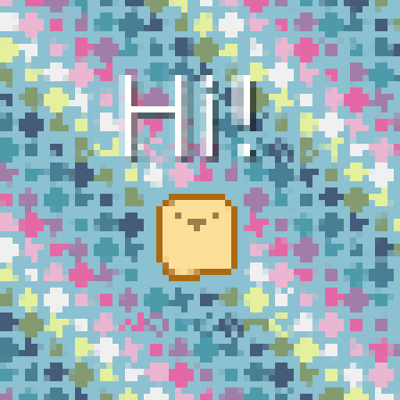

# push
**push** is a simple resolution-handling library for LÖVE that allows you to focus on making your game with a fixed resolution.



## Demo
This demo creates a 1280x720 resizable window and sets push to an upscaled 800x600 resolution. Under the "Draw stuff here!" comment, add some drawing functions to see push in action!
```lua
push = require "push"

love.window.setMode(1280, 720, {resizable = true}) -- Resizable 1280x720 window
push.setupScreen(800, 600, {upscale = "normal"}) -- 800x600 game resolution, upscaled

-- Make sure push follows LÖVE's resizes
function love.resize(width, height)
	push.resize(width, height)
end

function love.draw()
	push.start()
		-- Draw stuff here!
	push.finish()
end
```

## Usage
After applying changes to LÖVE's window using `love.window.setMode()`, init **push**:
```lua
push.setupScreen(pushWidth, pushHeight, {upscale = ..., canvas = ...})
```
`pushWidth` and `pushHeight` represent **push's** fixed resolution.

The last argument is a table containing settings for **push**:
* `upscale` (string): upscale **push's** resolution to the current window size
  * `"normal"`: fit to the current window size, preserving aspect ratio
  * `"pixel-perfect"`: pixel-perfect scaling using integer scaling (for values ≥1, otherwise uses normal scaling)
  * `"stretched"`: stretch to the current window size
* `canvas` (bool): use and upscale canvas set to **push's** resolution

Hook **push** into the `love.resize()` function so that it follows LÖVE's resizes:
```lua
function love.resize(width, height)
	push.resize(width, height)
end
```

Finally, apply **push** transforms:
```lua
function love.draw()
	push.start()
		-- Draw stuff here!
	push.finish()
end
```

## Multiple shaders
Any method that takes a shader as an argument can also take a *table* of shaders instead. The shaders will be applied in the order they're provided.

Set multiple global shaders
```lua
push.setShader({ shader1, shader2 })
```

Set multiple canvas-specific shaders
```lua
push.setupCanvas({{name = "multiple_shaders", shader = {shader1, shader2}}})
```

## Advanced canvases/shaders
**push** provides basic canvas and shader functionality through the `canvas` flag in push:setupScreen() and push:setShader(), but you can also create additional canvases, name them for later use and apply multiple shaders to them.

Set up custom canvases:
```lua
push.setupCanvas(canvasList)

-- e.g. push.setupCanvas({{name = "foreground", shader = foregroundShader}, {name = "background"}})
```

Shaders can be passed to canvases directly through push:setupCanvas(), or you can choose to set them later.
```lua
push.setShader(canvasName, shader)
```

Then, you just need to draw your game on different canvases like you'd do with love.graphics.setCanvas():
```lua
push.setCanvas(canvasName)
```

## Misc
Update settings:
```lua
push.updateSettings({settings})
```

Set a post-processing shader (will apply to the whole screen):
```lua
push.setShader([canvasName], shader)
```
You don't need to call this every frame. Simply call it once, and it will be stored into **push** until you change it back to something else. If no `canvasName` is passed, shader will apply to the final render. Use it at your advantage to combine shader effects.

Convert coordinates:
```lua
push.toGame(x, y) -- Convert coordinates from screen to game (useful for mouse position)
-- push.toGame will return false for values that are outside the game, be sure to check that before using them!

push.toReal(x, y) -- Convert coordinates from game to screen
```

Get game dimensions:
```lua
push.getWidth() -- Returns game width

push.getHeight() -- Returns game height

push.getDimensions() -- Returns push.getWidth(), push.getHeight()
```
